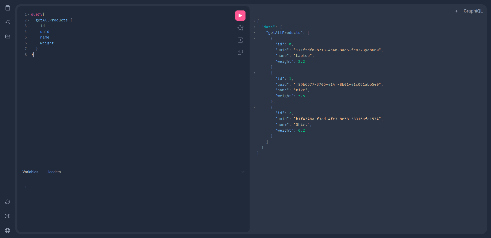

# Hands On with Product Service

This section provides a hands-on walkthrough of implementing and testing a Product Service using the three synchronous communication technologies previously discussed. We’ll explore the API functionality with runnable examples and conclude with a performance report.

## Product Service Overview
This service is a simple API that allows users to manage products. It supports operations such as listing products, retrieving a product by UUID, adding a new product, and deleting a product.

Each product in our service has the following structure:

```json
{
  "id": 1,
  "uuid": "550e8400-e29b-41d4-a716-446655440000",
  "name": "Kiwi",
  "weight": 12.5
}
```

## Set up the Environment
To run the examples, go in the `code` directory and run the following command to run all the containers:


```bash
docker compose up -d --build
```

The command will build and start the Product Service in all its implementations (Spring Boot, FastAPI, GraphQL, and gRPC).  

A small dashboard will be available at `http://localhost:3000` to navigate to all the implementations.
The implementations will be available at the following ports:
| Implementation | Port    |
| -------------- | ------- |
| Spring Boot    | 8001    |
| FastAPI        | 8002    |
| GraphQL        | 8003    |
| gRPC           | 8004    |

## REST

### Spring Boot (Java)

Spring Boot is a powerful framework for building RESTful APIs in Java. It simplifies the setup and configuration of Spring applications, allowing developers to focus on writing business logic.

#### Test with `curl`
##### List of all products
```bash
curl http://localhost:8001/products
```
##### Add a new product
```bash
curl -X POST http://localhost:8001/products \
     -H "Content-Type: application/json" \
     -d '{"uuid": "550e8400-e29b-41d4-a716-446655440000", "name": "Kiwi", "weight": 12.5}' 
```
##### Get product by UUID
```bash
curl http://localhost:8001/products/<UUID>
```

### FastAPI (Python)

Implementing an API with FastAPI is straightforward and efficient. Each endpoint is defined using Python decorators, and FastAPI automatically handles request parsing and response serialization. For example to define the method and the endpoint to get all products, this code can be used:

```python
@app.get("/products", response_model=List[Product])
def get_all_products():
    return products
```
The decorator `@app.get("/products")` defines the endpoint, and `response_model=List[Product]` specifies the expected response format.

#### Test with `curl`

##### List of all products

```bash
curl http://localhost:8002/products
```
##### Add a new product
```bash
curl -X POST http://localhost:8002/products \
     -H "Content-Type: application/json" \
     -d '{"name": "Kiwi", "weight": 12.5}'
```
##### Get product by UUID
```bash
curl http://localhost:8002/products/<UUID>
```

## GraphQL (Strawberry, Python)

GraphQL provides a flexible and efficient way to interact with APIs.  
GraphQL supports three main operation types:
- **Query**: For fetching data.
- **Mutation**: For modifying data (adding, updating, deleting).
- **Subscription**: For real-time updates (not covered in this example).

With Strawberry, a Python library for building GraphQL APIs, we can define our schema and resolvers easily.
### Schema Definition

The schema for a product can be defined as follows:

```python
@strawberry.type
class Product:
    id: int
    uuid: UUID
    name: str
    weight: float
```

### Resolvers
Resolvers are functions that handle the logic for fetching data. For example, to get all products:

```python
@strawberry.type
class Query:
    @strawberry.field
    def get_all_products(self) -> List[Product]:
        return products 
```

### Sample Query

```graphql
query {
  getAllProducts {
    id
    uuid
    name
    weight
  }
}
```

### Sample Mutation

```graphql
mutation {
  addProduct(name: "Kiwi", weight: 12.5) {
    uuid
    name
  }
}
```

### Test

#### With `GraphiQL`
GraphiQL is an interactive in-browser GraphQL IDE that allows you to explore and test your GraphQL API. You can access it by navigating to `http://localhost:8003/graphql` in the web browser once the service runs.



You can run queries and mutations directly in the interface, making it easy to test your API without needing to write `curl` commands.


#### With `curl`

##### Query
```bash
curl -X POST http://localhost:8003/graphql \
     -H "Content-Type: application/json" \
     -d '{"query": "{ getAllProducts { id uuid name weight } }"}'
```
###### Mutation
```bash
curl -X POST http://localhost:8003/graphql \
     -H "Content-Type: application/json" \
     -d '{"query": "mutation { addProduct(name: \"Kiwi\", weight: 12.5) { uuid name } }"}'
```

## gRPC (Python)

The heart of gRPC is the `.proto` file, which defines the service and its methods. Below is an example of the definition of the Product:

```proto
message Product {
  int32 id = 1;
  string uuid = 2;
  string name = 3;
  float weight = 4;
}
```
In this definition, we define a `Product` message with fields for `id`, `uuid`, `name`, and `weight`. The numbers after the field names are unique identifiers for each field in the message.
The `.proto` file also defines the service, its methods and the formato of the requests and responses. For example, to define a product request we can use the following definition:

```proto
message ProductRequest {
  string name = 1;
  float weight = 2;
}
```
We then dfine a method, for example, to add a product:

```proto
rpc AddProduct(ProductRequest) returns (Product);
```
So the above method will take a `ProductRequest` message (with the two fields of name and weight) as input and return a `Product` message (with all the additional information) as output.

After defining the `.proto` file, we need to generate the gRPC code. This can be done using the `grpc_tools.protoc` command:

```bash
python -m grpc_tools.protoc -I. --python_out=. --grpc_python_out=. proto/product.proto
```

This command generates the necessary Python code for gRPC based on the `.proto` file. The generated code includes classes for the messages and the service, which can be used to implement the server and client.

## gRPC Server Implementation
The gRPC server implementation is straightforward. We define a class that inherits from the generated service class and implements the methods defined in the `.proto` file. For example, to implement the `AddProduct` method:

```python
def AddProduct(self, request, context):
        new_product = product_pb2.Product(
            id=self.current_id,
            uuid=str(uuid.uuid4()),
            name=request.name,
            weight=request.weight
        )
        self.products.append(new_product)
        self.current_id += 1
        return new_product
```

This method creates a new `Product` instance using the data from the `ProductRequest` and adds it to the list of products. It also increments the current ID for the next product.
### Test with `client.py`

A simple gRPC client can be used to test the Product Service. The client connects to the gRPC server and invokes methods defined in the `.proto` file. 

Code can be found in `code/product_service_grpc/client.py` and can be run as follows:

```bash
python client.py
```

## Performance Report

Performance differences between the frameworks can be significant, especially under load. Below is a summary of the performance testing results for each framework when handling 100,000 requests to get all products and a specific product by UUID.
Two scenarios were tested:
1. Concurrent user requests to get all products and a specific product by UUID.

| Framework   | # of Requests   | Mean Latency (ms) | RPS (requests/sec) |
| ----------- | ---------- | ----------------- | ------------------ |
| Spring Boot | 100000     | 12.28             | 2848               |
| FastAPI     | 100000     | 13            | 2555           |
| GraphQL     | 100000     | 49.1            | 1013                |
| gRPC        | 100000     | 0.17              | 5300               |

2. Concurrent user requests to add and delete a new product.


> Performance testing executed with `locust` simulating 50 concurrent users (ramp-up of 2).

The results indicate that gRPC outperforms the other frameworks significantly. Spring Boot and FastAPI also performs well, GraphQL show higher latencies and lower RPS, likely due to the overhead of parsing and executing GraphQL queries. We have to remember however that GraphQL is more flexible and allows for more complex queries, which can be beneficial in many scenarios.

## Replicating Performance Tests
To replicate the performance tests, you can use the `locust` tool. The configuration files for each framework are located in the `code/loadtesting` directory. There will be a directory for each framework, containing a `locustfile.py` that defines the load test scenarios.
To run, for example, the test for Spring Boot, go in the `code/loadtesting/locust_REST` directory and run the following commands:

```bash
. env/bin/activate
locust
```
Then in the dashboard, set the host to `http://localhost:8089` and insert the number of users, the ramp-up and the host to test on (on `http://localhost:<port>` where `<port>` is the port of the service you want to test, e.g., `8001` for Spring Boot).

## References
- [Spring Boot Documentation](https://docs.spring.io/spring-boot/index.html) 
- [FastAPI Documentation](https://fastapi.tiangolo.com/)
- [GraphQL Documentation](https://graphql.org/learn/)
- [Strawberry Documentation](https://strawberry.rocks/docs/)
- [gRPC Documentation](https://grpc.io/docs/)
- [Protobuf Documentation](https://protobuf.dev/)

